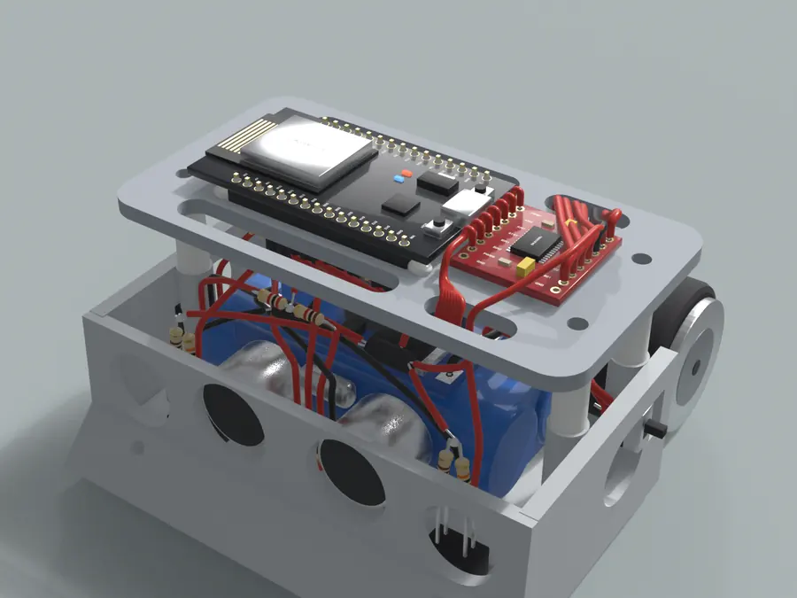

# Guerreiros de Realengo · robô de mini sumô

Robô **autônomo** de mini sumô (base de até 10 × 10 cm e até 500 g) do grupo **Guerreiros de Realengo** para a **InovaWeek da UVV**. Ninguém dirige o robô: o juiz dá o **START** e o **STOP** pelo controle, e ele procura o adversário e ataca sozinho.



## Manual de montagem

### [matheuscortes02.github.io/Guerreiros-de-Realengo-Robo-sumo/](https://matheuscortes02.github.io/Guerreiros-de-Realengo-Robo-sumo/)

O site é um **manual no estilo LEGO**, feito para ser seguido na bancada pelo celular:

- **69 passos em 13 blocos**, uma ação por passo;
- **blocos em cards**: entre num bloco e passe os passos um por tela, com botões grandes, deslizar para o lado e continuar de onde parou;
- a primeira tela de cada bloco mostra **os fios que ele usa, já com o tamanho de corte**;
- em cada passo, a **imagem do Blender** com a peça em tamanho real, o **número de cada fio** em cima dele e uma **lupa** com o detalhe;
- avisos do que **queima** se ligar errado e o que **conferir com o multímetro** antes de seguir;
- **vídeo da montagem** com capítulos por bloco, **lista de corte**, **ligações por peça** e **achar fio** pelo número da fita;
- duas versões: a **padrão**, com fios coloridos e tudo soldado do zero ([index.html](https://matheuscortes02.github.io/Guerreiros-de-Realengo-Robo-sumo/)), e a **do grupo**, só com fio vermelho e preto e com sonar, receptor e motores já soldados ([grupo.html](https://matheuscortes02.github.io/Guerreiros-de-Realengo-Robo-sumo/grupo.html));
- **português e inglês** pelas bandeiras no topo ([en.html](https://matheuscortes02.github.io/Guerreiros-de-Realengo-Robo-sumo/en.html) · [grupo-en.html](https://matheuscortes02.github.io/Guerreiros-de-Realengo-Robo-sumo/grupo-en.html)) e **tema claro e escuro** pelo ícone de sol e lua.

## Equipe

Eduardo Nascimento · Gabriel da Silva · Gustavo Nunes · Kaike Panetto · Matheus Cortes

## Como o robô está montado

| Onde | O que fica |
|---|---|
| Frente, embaixo | 2 sensores de borda **TCRT5000 de 4 pernas**, colados nas janelas do piso |
| Frente | sonar **HC-SR04** nos dois furos do meio |
| Lateral direita | receptor do juiz **dentro do furo redondo**, bolinha para fora (lado oposto da chave) |
| Baia | bateria 2S 7,4 V com velcro · regulador **LM2596 colado em cima da bateria** |
| Lateral esquerda | chave deslizante **SS12D00** (3 pinos) |
| Trás | caixa com 2 motores N20 e rodas |
| Plataforma (**+17 mm**: espaçador de 12 mm com um de 5 mm em cima) | **ponte H TB6612** à esquerda · **ESP32** à direita, **apoiado na plataforma com os pinos atravessando dois rasgos** e o **USB virado para a esquerda** |

Esquerda e direita são sempre do robô: sonar apontando para longe de você.

### Alimentação

- **Bateria (+)** vai por dois caminhos: fio **3** direto ao **VM da ponte H** (motores) e fio **1** ao pino do meio da chave.
- A chave **SS12D00 aguenta 0,5 A**, por isso liga **só a eletrônica**: fio **2** até o IN+ do LM2596. A eletrônica puxa uns 0,2 A; os motores, até 3 A, não passam por ela.
- **LM2596** ajustado em **5,00 V** alimenta o VIN do ESP32 (fio 10) e o sonar (fio 12).
- O **3V3 do ESP32** vai a uma **emenda amarela** (fio 14) que alimenta os dois sensores de borda, o receptor e o VCC da ponte H.
- **GND** não é um fio só: o − da bateria vai à ponte H (4) e ao LM2596 (5); a saída do LM2596 vai ao ESP32 (11) e ao sonar (13); o outro GND do ESP32 vai a uma **emenda preta** (15) com os sensores, o receptor e o divisor do sonar.
- Com o cabo USB ligado, a chave fica em **DESLIGA**. Para guardar o robô, desconecte a bateria.

### Os 16 pinos usados no ESP32

Cada fio é soldado **na ponta do pino, por baixo da plataforma**, com termorretrátil. Por baixo não aparece nenhum nome: conte a partir da ponta do USB (o 1º da fileira da frente é o VIN; o 1º da de trás, o 3V3). Os 7 fios da ponte H descem pelo rasgo R2.

| Pino | Fileira | Posição a partir do USB | Fio | Vem de |
|---|---|---|---|---|
| VIN | frente (EN … VIN) | 1º | 10 | LM2596 · OUT+ |
| GND | frente (EN … VIN) | 2º | 11 | LM2596 · OUT− |
| D13 | frente (EN … VIN) | 3º | 31 | ponte H · STBY |
| D14 | frente (EN … VIN) | 5º | 34 | ponte H · PWMB |
| D27 | frente (EN … VIN) | 6º | 29 | ponte H · AIN2 |
| D26 | frente (EN … VIN) | 7º | 30 | ponte H · AIN1 |
| D25 | frente (EN … VIN) | 8º | 28 | ponte H · PWMA |
| D33 | frente (EN … VIN) | 9º | 33 | ponte H · BIN2 |
| D32 | frente (EN … VIN) | 10º | 32 | ponte H · BIN1 |
| D35 | frente (EN … VIN) | 11º | 24 | sensor direito · perna C |
| D34 | frente (EN … VIN) | 12º | 23 | sensor esquerdo · perna C |
| 3V3 | trás (D23 … 3V3) | 1º | 14 | emenda amarela |
| GND | trás (D23 … 3V3) | 2º | 15 | emenda preta |
| D5 | trás (D23 … 3V3) | 8º | 25 | sonar · TRIG |
| D18 | trás (D23 … 3V3) | 9º | 26B | resistor 1 kΩ |
| D19 | trás (D23 … 3V3) | 10º | 27 | receptor · OUT |

### Lista de corte

Comprimentos medidos no modelo 3D com a disposição real e com sobra (caminho + 15% + 20 mm; +40 mm nos fios que ligam a baia à plataforma, para dar para soldar com a plataforma virada). Total: **1050 mm de 22 AWG** e **2660 mm de 26 AWG**.

| Fio | Cor | Bitola | Corte | De | Para | Passa por |
|---|---|---|---|---|---|---|
| 1 | vermelho | 22 AWG | 60 mm | conector da bateria · + | chave · COM | embaixo da plataforma |
| 2 | vermelho | 22 AWG | 60 mm | chave · P1 | LM2596 · IN+ | embaixo da plataforma |
| 3 | vermelho | 22 AWG | 120 mm | conector da bateria · + | ponte H · VM | sobe pelo rasgo R4 |
| 4 | preto | 22 AWG | 120 mm | conector da bateria · − | ponte H · GND | sobe pelo rasgo R4 |
| 5 | preto | 22 AWG | 50 mm | conector da bateria · − | LM2596 · IN− | embaixo da plataforma |
| 6 | cinza | 22 AWG | 160 mm | motor esquerdo | ponte H · A01 | furo Ø6 da tampa e rasgo R4 |
| 7 | cinza | 22 AWG | 160 mm | motor esquerdo | ponte H · A02 | furo Ø6 da tampa e rasgo R4 |
| 8 | branco | 22 AWG | 160 mm | motor direito | ponte H · B01 | furo Ø6 da tampa e rasgo R4 |
| 9 | branco | 22 AWG | 160 mm | motor direito | ponte H · B02 | furo Ø6 da tampa e rasgo R4 |
| 10 | laranja | 26 AWG | 130 mm | LM2596 · OUT+ | ESP32 · VIN | sobe por baixo da plataforma até a ponta do pino |
| 11 | preto | 26 AWG | 120 mm | LM2596 · OUT− | ESP32 · GND | sobe por baixo da plataforma até a ponta do pino |
| 12 | laranja | 26 AWG | 100 mm | LM2596 · OUT+ | sonar · VCC | embaixo da plataforma |
| 13 | preto | 26 AWG | 100 mm | LM2596 · OUT− | sonar · GND | embaixo da plataforma |
| 14 | amarelo | 26 AWG | 110 mm | ESP32 · 3V3 | emenda amarela | sobe por baixo da plataforma até a ponta do pino |
| 15 | preto | 26 AWG | 110 mm | ESP32 · GND | emenda preta | sobe por baixo da plataforma até a ponta do pino |
| 16 | amarelo | 26 AWG | 50 mm | emenda amarela | resistores do sensor esquerdo | embaixo da plataforma |
| 17 | amarelo | 26 AWG | 70 mm | emenda amarela | resistores do sensor direito | embaixo da plataforma |
| 18 | amarelo | 26 AWG | 100 mm | emenda amarela | receptor · VCC | embaixo da plataforma |
| 19 | amarelo | 26 AWG | 130 mm | emenda amarela | ponte H · VCC | sobe pelo rasgo R2 |
| 20 | preto | 26 AWG | 80 mm | emenda preta | sensor esquerdo · perna K | embaixo da plataforma |
| 21 | preto | 26 AWG | 50 mm | emenda preta | sensor direito · perna K | embaixo da plataforma |
| 22 | preto | 26 AWG | 70 mm | emenda preta | receptor · GND | embaixo da plataforma |
| 23 | branco | 26 AWG | 150 mm | sensor esquerdo · perna C | ESP32 · D34 | sobe por baixo da plataforma até a ponta do pino |
| 24 | cinza | 26 AWG | 110 mm | sensor direito · perna C | ESP32 · D35 | sobe por baixo da plataforma até a ponta do pino |
| 25 | verde | 26 AWG | 150 mm | sonar · TRIG | ESP32 · D5 | sobe por baixo da plataforma até a ponta do pino |
| 26A | azul | 26 AWG | 70 mm | sonar · ECHO | resistor 1 kΩ | embaixo da plataforma |
| 26B | azul | 26 AWG | 110 mm | resistor 1 kΩ | ESP32 · D18 | sobe por baixo da plataforma até a ponta do pino |
| 26C | preto | 26 AWG | 40 mm | resistor 2 kΩ | emenda preta | embaixo da plataforma |
| 27 | roxo | 26 AWG | 130 mm | receptor · OUT | ESP32 · D19 | sobe por baixo da plataforma até a ponta do pino |
| 28 | marrom | 26 AWG | 110 mm | ponte H · PWMA | ESP32 · D25 | desce pelo rasgo R2 e sobe por baixo até a ponta do pino |
| 29 | azul | 26 AWG | 100 mm | ponte H · AIN2 | ESP32 · D27 | desce pelo rasgo R2 e sobe por baixo até a ponta do pino |
| 30 | verde | 26 AWG | 100 mm | ponte H · AIN1 | ESP32 · D26 | desce pelo rasgo R2 e sobe por baixo até a ponta do pino |
| 31 | roxo | 26 AWG | 90 mm | ponte H · STBY | ESP32 · D13 | desce pelo rasgo R2 e sobe por baixo até a ponta do pino |
| 32 | verde | 26 AWG | 100 mm | ponte H · BIN1 | ESP32 · D32 | desce pelo rasgo R2 e sobe por baixo até a ponta do pino |
| 33 | azul | 26 AWG | 100 mm | ponte H · BIN2 | ESP32 · D33 | desce pelo rasgo R2 e sobe por baixo até a ponta do pino |
| 34 | marrom | 26 AWG | 80 mm | ponte H · PWMB | ESP32 · D14 | desce pelo rasgo R2 e sobe por baixo até a ponta do pino |

## Firmware

Código em [`firmware/guerreiros_de_realengo/guerreiros_de_realengo.ino`](firmware/guerreiros_de_realengo/guerreiros_de_realengo.ino). Arduino IDE com a placa **esp32** da Espressif e a biblioteca **IRremote**; placa **DOIT ESP32 DEVKIT V1**. Pinos: ponte H em D25, D26, D27 (motor esquerdo), D14, D32, D33 (motor direito) e D13 (STBY); sonar em D5 e D18; sensores de borda em D34 e D35; receptor em D19.

Primeira gravação com `MODO_TESTE = true`: lê os códigos do controle do juiz, mostra sensores e sonar e gira cada motor pelas teclas `e` e `d`, com o robô no ar. Depois `MODO_TESTE = false`.

## Impressão 3D

| Placa | Arquivo | Conteúdo |
|---|---|---|
| 1 | `impressao/IMPRESSAO-1-chassi` (.stl ou .3mf) | chassi |
| 2 | `impressao/IMPRESSAO-2-restante` (.stl ou .3mf) | capô (já invertido), plataforma, caixa de motor e tampa |

PLA, camada 0,2 mm, 4 perímetros, 25%, sem suporte, z-hop ligado na placa 2.

## O que tem neste repositório

```
index.html                  manual de montagem (GitHub Pages)
docs/manual/                imagens do manual (webp)
firmware/                   código do ESP32
impressao/                  arquivos para o fatiador
modelo-3d/robo-sumo.blend   cena do Blender com a disposição e os fios traçados
```

---

Projeto acadêmico do grupo **Guerreiros de Realengo** para a InovaWeek da UVV. O chassi foi derivado de um modelo STL de terceiros (*Sarı Yazma Tasarım V2*), reescalado e adaptado; confira a licença do original antes de redistribuir fora do contexto acadêmico.
