# Guerreiros de Realengo · robô de mini sumô

Robô **autônomo** de mini sumô (base de até 10 × 10 cm e até 500 g) desenvolvido pelo grupo **Guerreiros de Realengo** para a **InovaWeek da UVV**.

A única função dele é lutar: **identificar o adversário e atacar**. Ninguém dirige o robô. O controle fica com o **juiz**, que aponta para a arena e dá o **START nos dois robôs ao mesmo tempo** (e o STOP no fim). Depois do START ele procura o oponente e ataca sozinho.

Chassi impresso em 3D, tração traseira com dois micromotores N20, **ESP32** como cérebro, ponte H **TB6612FNG**, sonar **HC-SR04** para achar o oponente, dois sensores **TCRT5000** para não sair da arena e um receptor infravermelho para o sinal do juiz. Tudo fica sob um capô fechado.

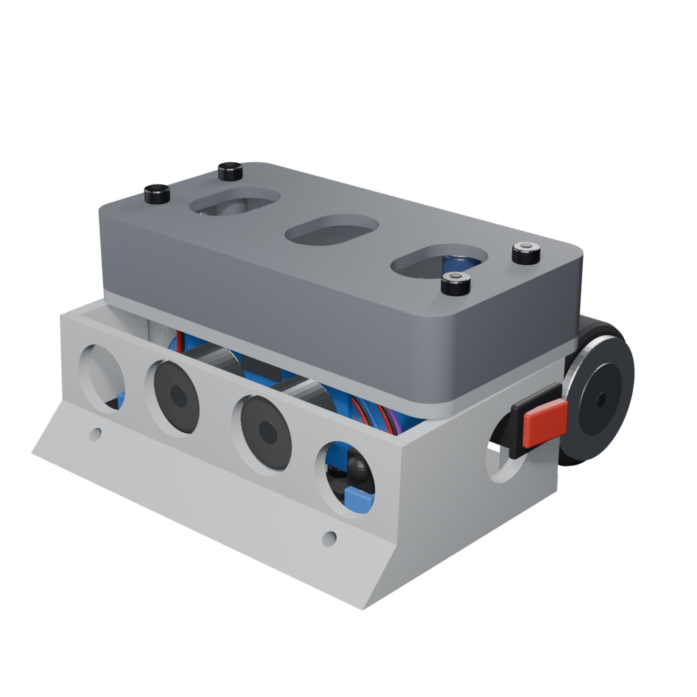

## Site do projeto

### [matheuscortes02.github.io/Guerreiros-de-Realengo-Robo-sumo](https://matheuscortes02.github.io/Guerreiros-de-Realengo-Robo-sumo/)

O site é o **manual de montagem completo** do robô, feito para ser seguido na bancada, no computador ou no celular. Ele junta tudo o que o grupo precisa para sair das peças soltas até o robô lutando:

- **vídeo da montagem** com capítulos, do chassi ao capô;
- **12 etapas** com fotos e medidas conferidas no modelo 3D em tamanho real;
- **desenho de solda placa por placa**: ESP32, ponte H, LM2596, sensores de borda, ultrassônico, receptor do juiz, chave e bateria;
- explicação de **como um pino de 3V3 e poucos GND alimentam tudo**, com as emendas;
- **lista de corte dos 34 fios**, ordem de solda e checagem com multímetro antes de ligar a bateria;
- **firmware do ESP32** com botão de copiar.

[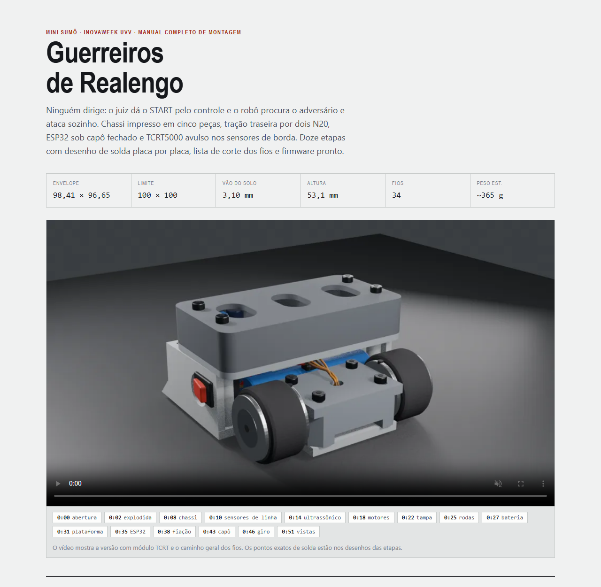](https://matheuscortes02.github.io/Guerreiros-de-Realengo-Robo-sumo/)

## Equipe

| Integrante |
|---|
| Eduardo Nascimento |
| Gabriel da Silva |
| Gustavo Nunes |
| Kaike Panetto |
| Matheus Cortes |

## Sumário

- [Site do projeto](#site-do-projeto)
- [Visão geral](#visão-geral)
- [O que tem neste repositório](#o-que-tem-neste-repositório)
- [Manual de montagem e site](#manual-de-montagem-e-site)
- [Impressão 3D](#impressão-3d)
- [Lista de componentes](#lista-de-componentes)
- [Eletrônica](#eletrônica)
- [Firmware](#firmware)
- [Montagem em 12 etapas](#montagem-em-12-etapas)
- [Cuidados que evitam queimar placa](#cuidados-que-evitam-queimar-placa)
- [Solução de problemas](#solução-de-problemas)
- [Referências](#referências)

## Visão geral

| Item | Valor |
|---|---|
| Comportamento | espera o START do juiz · procura girando · ataca em linha reta · recua na borda branca · para no STOP |
| Envelope | 98,41 × 96,65 mm (limite 100 × 100) |
| Altura | 53,1 mm |
| Peso estimado | cerca de 365 g (limite 500 g) |
| Vão do solo | 3,10 mm |
| Tração | traseira · 2 × GA12-N20 6 V 300 RPM · rodas StickyMAX Ø32 |
| Controle | ESP32 DevKit V1, 30 pinos |
| Sensores | 1 × HC-SR04 (adversário) · 2 × TCRT5000 (borda) · receptor IR VS1838B ou KY-022 (juiz) |
| Alimentação | bateria 2S 7,4 V 2600 mAh · regulador LM2596 ajustado em 5,00 V |
| Peças impressas | 5 peças em 2 placas de impressão · 111,5 g de PLA |
| Fiação | 34 fios · 2 emendas · nenhuma barra de pinos |

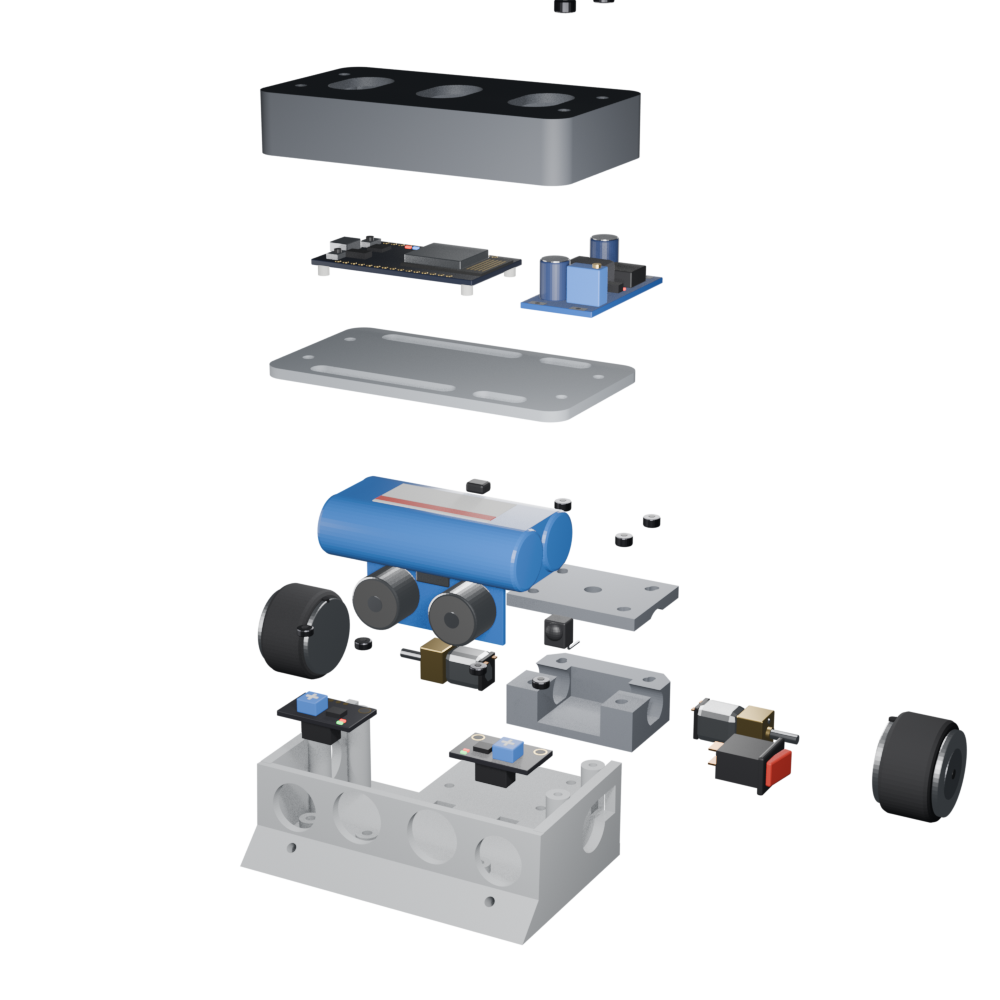

## O que tem neste repositório

```
index.html                         site: manual completo de montagem (GitHub Pages)
impressao/                         arquivos para o fatiador
  IMPRESSAO-1-chassi.stl / .3mf      chassi, impresso sozinho
  IMPRESSAO-2-restante.stl / .3mf    capô, plataforma, caixa de motor e tampa
firmware/
  guerreiros_de_realengo/            código do ESP32 para a Arduino IDE
docs/
  montagem-robo-sumo.mp4             vídeo da montagem
  imagens/                           renders de cada etapa e vistas
  diagramas/                         desenhos de solda e fiação
modelo-3d/
  robo-sumo.blend                    cena do Blender com os componentes em tamanho real
```

## Manual de montagem e site

O site é o [`index.html`](index.html) da raiz do repositório, publicado pelo GitHub Pages em **https://matheuscortes02.github.io/Guerreiros-de-Realengo-Robo-sumo/**. Também dá para baixar o arquivo e abrir direto no navegador (Chrome, Edge ou Firefox), sem internet: fotos e vídeo vão embutidos nele.

O vídeo mostra a versão com módulo TCRT e o caminho geral dos fios. Os pontos exatos de solda estão nos desenhos do manual e deste README.

### Como o site é publicado

O GitHub Pages está ligado em **Settings → Pages**, com **Deploy from a branch**, branch **main** e pasta **/ (root)**. Qualquer envio para a `main` que mude o `index.html` atualiza o site em um ou dois minutos. O arquivo `.nojekyll` na raiz faz o GitHub servir o `index.html` do jeito que está.

## Impressão 3D

| Placa | Arquivo | Conteúdo | Material |
|---|---|---|---|
| 1 | `impressao/IMPRESSAO-1-chassi` | chassi | 52,8 g |
| 2 | `impressao/IMPRESSAO-2-restante` | capô (já invertido), plataforma, caixa de motor e tampa | 58,7 g |

Configuração usada:

- PLA, camada 0,2 mm, 4 perímetros, 25% de preenchimento;
- **sem suporte**;
- **z-hop ligado** na placa 2 (as peças têm alturas diferentes);
- na placa 2, **não gire nada**: o capô só imprime sem suporte de cabeça para baixo;
- se o fatiador juntar as quatro peças num objeto só, use *Dividir em objetos*;
- se o `.stl` não abrir, use o `.3mf` com o mesmo nome. É a mesma peça.

Depois de imprimir o chassi, teste um transdutor do HC-SR04 nos dois furos centrais da frente: tem que entrar com a mão. O receptor do juiz fica atrás do furo externo Ø15 do lado esquerdo do robô.

## Lista de componentes

| Componente | Qtd | Observação |
|---|---|---|
| Roda StickyMAX S20 32 mm | 2 | Ø32 × 21 mm |
| Micromotor GA12-N20 6 V 300 RPM | 2 | eixo 3 mm em D |
| ESP32 DevKit V1 (30 pinos) | 1 | sem barra de pinos: fios soldados nos furos |
| Ponte H TB6612FNG | 1 | 21 × 18 mm |
| Regulador LM2596 | 1 | ajustar para 5,00 V antes de ligar o ESP32 |
| Sensor ultrassônico HC-SR04 | 1 | só um: os furos da frente comportam um |
| Sensor TCRT5000 avulso | 2 | opção principal · 10,2 × 5,8 × 7 mm |
| Módulo TCRT5000 | 0 ou 2 | opção B, usa os pedestais do chassi |
| Receptor IR VS1838B ou KY-022 | 1 | recebe START e STOP do juiz · atenção ao pino do meio |
| Bateria 7,4 V 2600 mAh (2S) | 1 | 65 × 36 × 18 mm |
| Conector para a bateria | 1 par | para tirar a bateria e carregar |
| Chave gangorra 10 A | 1 | furo 13 × 9 mm |
| Resistor 100 Ω | 2 | LED de cada TCRT |
| Resistor 10 kΩ | 2 | sinal de cada TCRT |
| Resistores 1 kΩ e 2 kΩ | 1 + 1 | divisor do ECHO |
| Fio flexível 22 AWG | ≈ 1 m | bateria, chave e motores |
| Fio flexível 26 AWG | ≈ 3 m | sinais e 3,3 V |
| Termorretrátil 2 e 3 mm | ≈ 1 m | pernas, resistores e emendas |
| Parafuso M3 × 25 + porca | 4 | caixa de motor |
| Parafuso M3 × 30 | 4 | capô + plataforma |
| Parafuso M3 × 8 | 4 | só na opção B |
| Espaçador de nylon 3 mm | 4 | sob o ESP32 |
| Fita dupla-face de espuma, cola quente, velcro | — | fixação |

## Eletrônica

### Esquerda e direita

Sempre do ponto de vista do **robô**: coloque ele na mesa com o sonar apontando para longe de você. O que está à sua esquerda é o lado esquerdo dele. O firmware usa a mesma convenção (canal A da ponte H = motor esquerdo).

### Três tensões

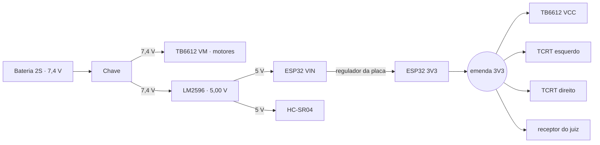

- **Um pino de 3V3 alimenta quatro componentes** porque o fio se divide numa emenda. O limite é a corrente: tudo no 3,3 V soma cerca de 130 mA.
- **GND é um ponto só.** Os furos GND de cada placa já são ligados por dentro; os fios unem as placas. Qualquer furo GND serve.
- **Nunca 5 V num pino do ESP32.** O ECHO do HC-SR04 passa por um divisor; o receptor IR e os TCRT ficam no 3,3 V.

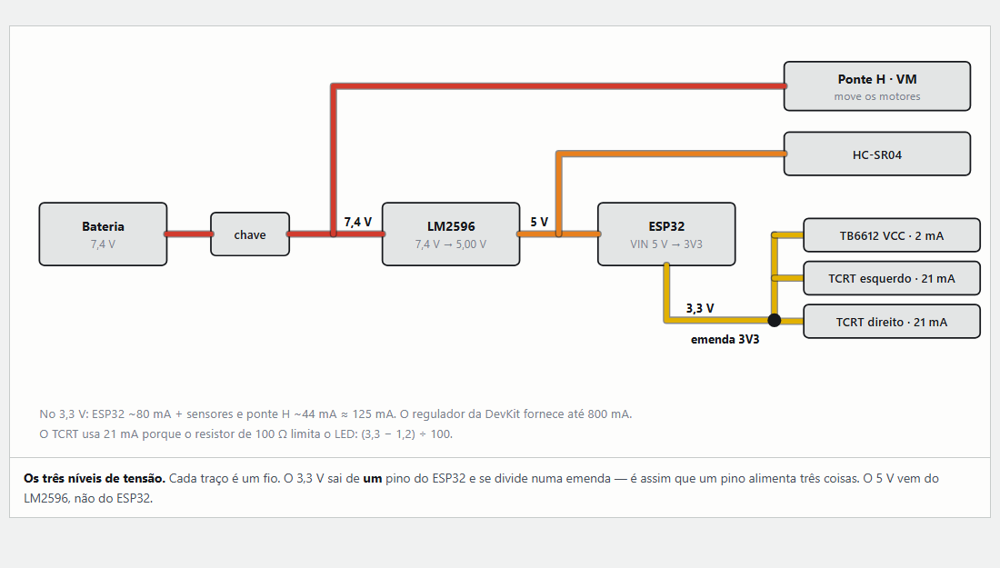

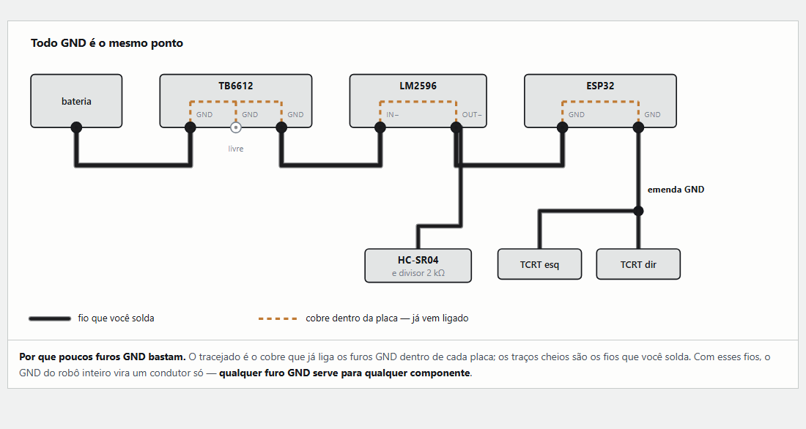

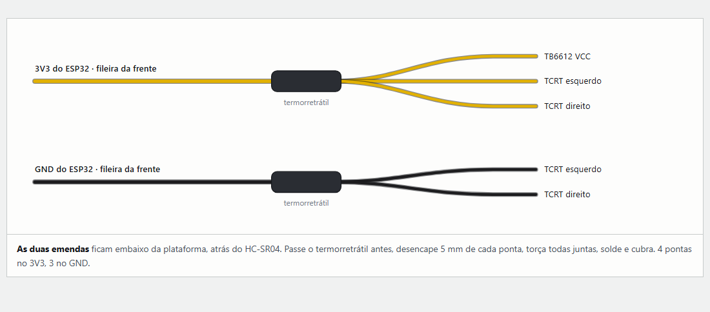

### Pinagem do ESP32

| ESP32 | Liga em | Observação |
|---|---|---|
| GPIO 25 | TB6612 PWMA | velocidade do motor esquerdo, PWM 20 kHz |
| GPIO 26 | TB6612 AIN1 | sentido do motor esquerdo |
| GPIO 27 | TB6612 AIN2 | sentido do motor esquerdo |
| GPIO 14 | TB6612 PWMB | velocidade do motor direito |
| GPIO 32 | TB6612 BIN1 | sentido do motor direito |
| GPIO 33 | TB6612 BIN2 | sentido do motor direito |
| GPIO 13 | TB6612 STBY | HIGH liga a ponte H |
| GPIO 5 | HC-SR04 TRIG | |
| GPIO 18 | HC-SR04 ECHO | pelo divisor 1 kΩ / 2 kΩ |
| GPIO 34 | TCRT esquerdo | entrada analógica |
| GPIO 35 | TCRT direito | entrada analógica |
| GPIO 19 | receptor do juiz | START e STOP |
| GPIO 2 | LED azul da placa | devagar = esperando o juiz · rápido = contando depois do START |
| VIN | LM2596 OUT+ | 5 V |
| GND (fileira de trás) | LM2596 OUT− | |
| 3V3 | emenda 3V3 | |
| GND (fileira da frente) | emenda GND | |

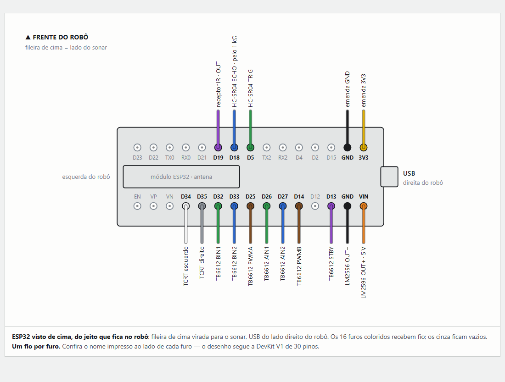

### Ponte H TB6612FNG

Solde todos os 15 fios com a placa na mão. Depois cole com os componentes para baixo, sob a plataforma, e a fileira de potência virada para os motores. A ordem dos furos muda entre fabricantes: vale o nome impresso na placa.

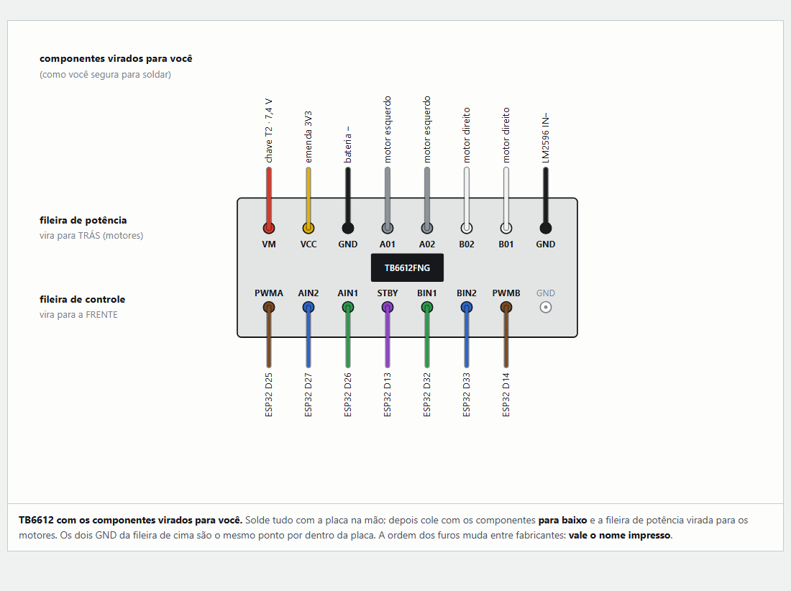

### Regulador LM2596

A entrada fica para trás e a saída para a frente. Cada furo da saída recebe dois fios: um por cima, que vai ao ESP32, e outro por baixo, que desce ao HC-SR04. **Ajuste 5,00 V antes de soldar a saída.**

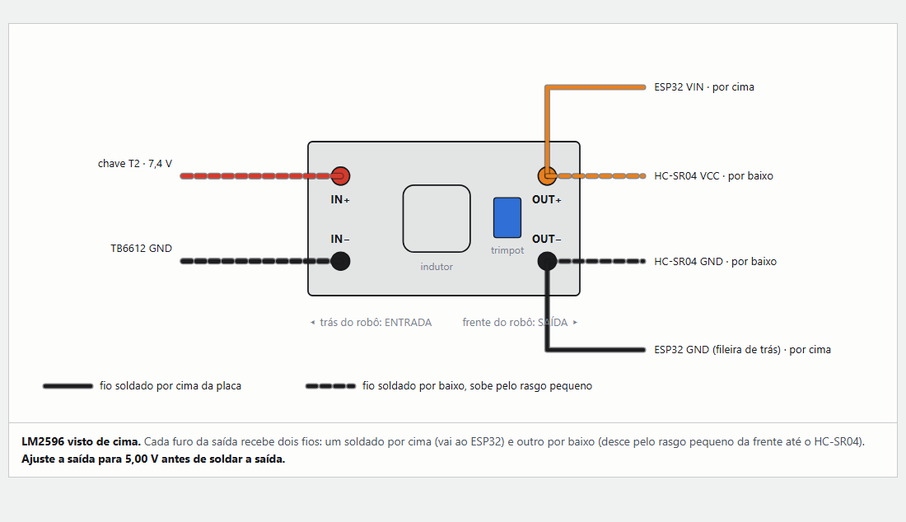

### Sensores de borda TCRT5000

**Opção A, principal: TCRT5000 avulso.** 100 Ω na perna A (LED), 10 kΩ entre a perna C e o 3V3, pernas K e E juntas no GND. O sinal sai da perna C para o ESP32. O sensor fica colado com cola quente na janela de 12 × 8 mm do piso, com a lente 0,3 mm acima do fundo: ele lê o chão a 3,4 mm, perto do pico de 2,5 mm do datasheet.

**Opção B: módulo TCRT5000.** Parafusado nos dois pedestais do chassi com M3 × 8. Os mesmos três fios: VCC no 3V3, GND no GND e D0 no sinal. O código é o mesmo.

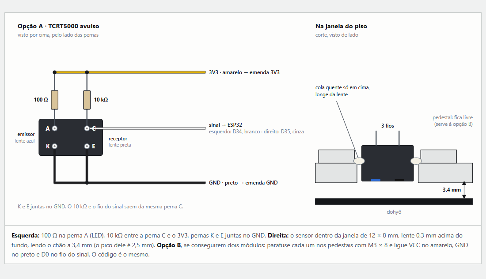

### HC-SR04 e divisor do ECHO

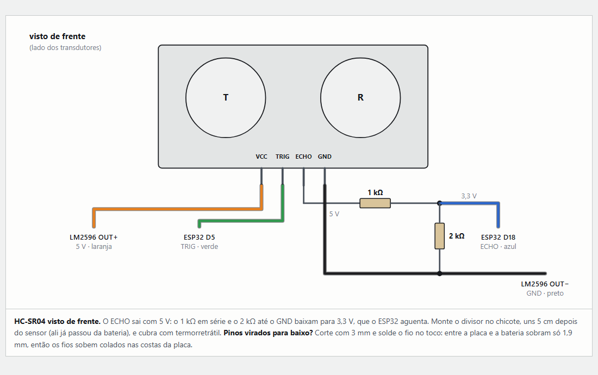

### Receptor do juiz

Recebe só o **START** e o **STOP** do controle do juiz. No VS1838B avulso o pino do meio é **GND**; na plaquinha KY-022 é **+**. Ligue pelo nome impresso.

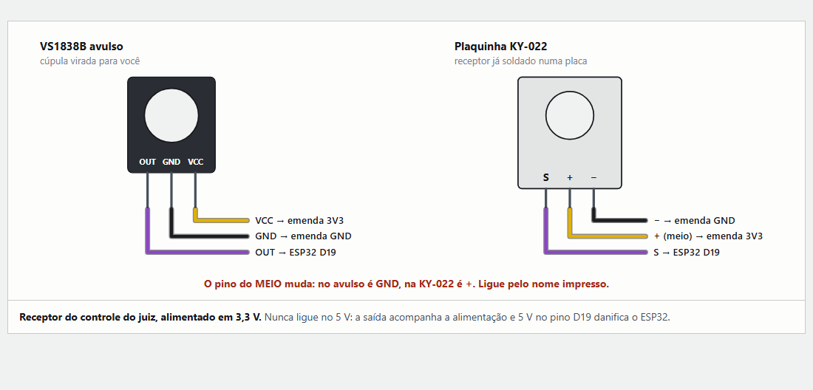

### Bateria, chave e motores

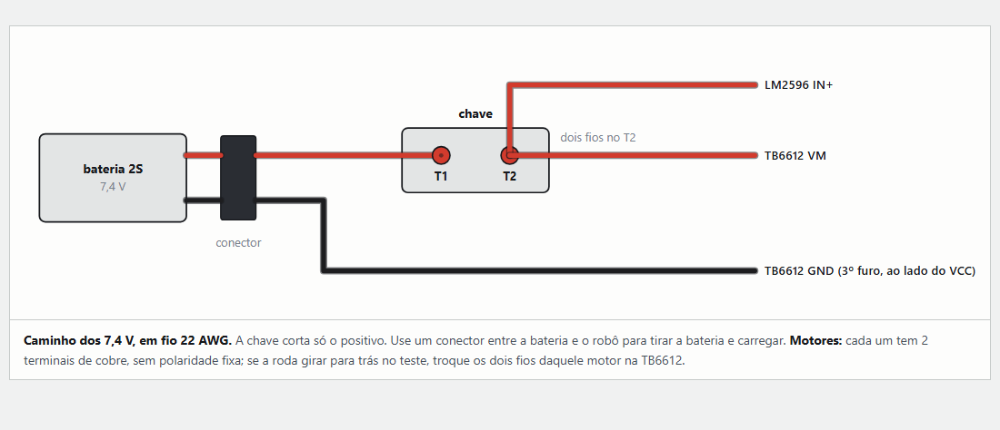

### Por onde os fios passam

A plataforma tem quatro rasgos. Os fios correm por cima da bateria, embaixo da plataforma, e sobem pelos rasgos.

| Rasgo | O que passa | Onde chega em cima |
|---|---|---|
| R1 · grande da frente | 3V3 e GND das emendas, TRIG, ECHO, IR e os sinais dos dois TCRT | fileira da frente do ESP32; D34 e D35 correm por baixo dele até a fileira de trás |
| R2 · pequeno da frente | 5 V e GND do HC-SR04 | OUT+ e OUT− do LM2596, soldados por baixo |
| R3 · grande de trás | os 7 fios de controle da ponte H | fileira de trás do ESP32 |
| R4 · pequeno de trás | 7,4 V da chave e GND da ponte H | IN+ e IN− do LM2596, soldados por baixo |
| por cima da plataforma | 5 V e GND do LM2596 | VIN e GND da fileira de trás do ESP32 |

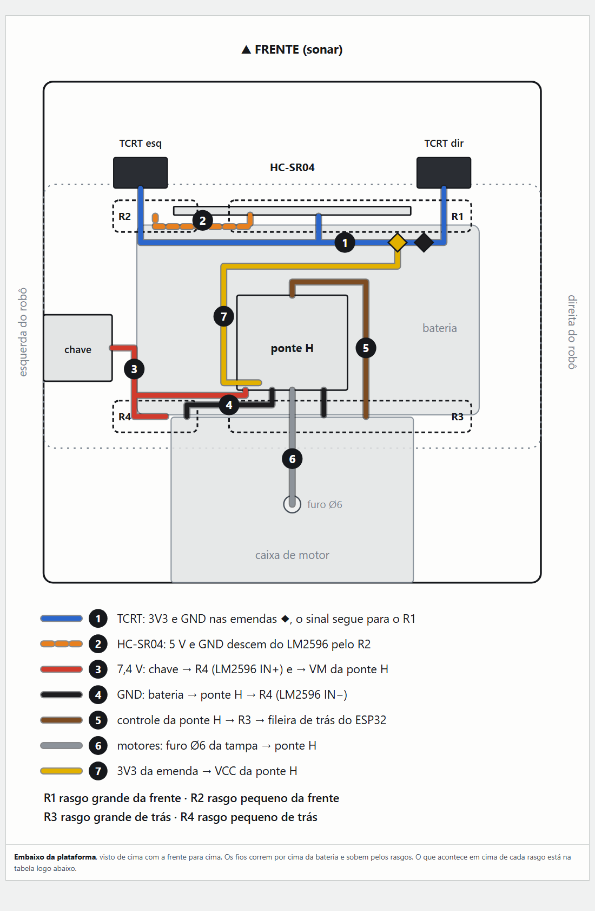

A lista de corte completa dos 34 fios está no manual.

## Firmware

Código em [`firmware/guerreiros_de_realengo/guerreiros_de_realengo.ino`](firmware/guerreiros_de_realengo/guerreiros_de_realengo.ino).

### Preparar a Arduino IDE

1. Gerenciador de Placas: instale **esp32** da Espressif (versão 3.3.11).
2. Gerenciador de Bibliotecas: instale **IRremote**, de Armin Joachimsmeyer (versão 4.7.1).
3. Selecione a placa **DOIT ESP32 DEVKIT V1** e a porta USB.

### Primeira gravação: modo teste

1. Ajuste o LM2596 para 5,00 V com multímetro antes de ligar o ESP32.
2. Grave com `MODO_TESTE = true` e abra o Monitor Serial a **115200**. Nesse modo os motores só giram quando você manda pelo cabo USB.
3. Aponte o controle do juiz (ou um do mesmo modelo), aperte START e depois STOP e anote os códigos. Preencha `IR_START` e `IR_STOP` e regrave.
4. Robô no preto: a leitura da linha fica alta (ex.: 3000). Na borda branca, baixa (ex.: 300).
5. Passe só o sensor do lado esquerdo sobre o branco: tem que mudar `esq`. Se mudar `dir`, os fios de D34 e D35 estão trocados.
6. Aproxime a mão da frente do robô: a distância tem que cair.
7. Com o **robô no ar**, digite no Monitor Serial:

| Tecla | O que faz |
|---|---|
| `e` | gira o motor esquerdo para a frente por 0,7 s |
| `d` | gira o motor direito para a frente por 0,7 s |
| `c` | calibra os sensores de linha com o robô no preto |

   Se uma roda girar para trás, troque os dois fios daquele motor na TB6612. Se girar a roda errada, troque os fios do canal A com os do canal B.

8. Confira no regulamento se o robô tem que esperar 5 s depois do START e ajuste `ESPERA_APOS_START` (5000 = 5 s; 0 = sai na hora do sinal).
9. Coloque `MODO_TESTE = false` e regrave.

### Na luta

1. Ligue a chave e ponha o robô no centro do dohyô, sobre o preto. O LED azul pisca devagar: ele está esperando o juiz.
2. O juiz aponta o controle e dá o **START** nos dois robôs ao mesmo tempo. O LED pisca rápido durante a espera.
3. O robô procura o adversário girando e ataca quando o sonar acha.
4. No **STOP** do juiz, ele para.

### Como o robô decide

| Estado | O que faz | Sai quando |
|---|---|---|
| `PARADO` | motores parados, LED devagar, mede o preto embaixo dele | recebe o START do juiz |
| `PREPARANDO` | espera `ESPERA_APOS_START`, LED rápido | termina a espera |
| `BUSCANDO` | gira no próprio eixo, alternando o lado | o sonar vê algo a até 45 cm em 2 leituras seguidas |
| `ATACANDO` | vai para a frente em velocidade máxima | perde o alvo |
| `RECUANDO` | dá ré por 320 ms | termina o tempo |
| `GIRANDO_FUGA` | gira para o lado oposto à borda por 380 ms | termina o tempo |

- **O controle é só do juiz:** o receptor aceita apenas START e STOP. Ninguém dirige o robô.
- **A borda tem prioridade sobre tudo:** em `BUSCANDO` ou `ATACANDO`, se qualquer sensor de linha ver branco, o robô recua na hora. Sair da arena é derrota.
- **O sonar não trava o programa:** o eco é medido por interrupção, então o laço nunca fica parado esperando.
- **Calibração automática:** enquanto espera o START, o robô acompanha a leitura do preto embaixo dele; na largada, usa 55% dessa leitura como limiar de cada sensor. Se a leitura sair baixa demais, usa `LIMIAR_PADRAO`.
- **STOP do juiz** para o robô em qualquer estado.

### Ajustes principais

| Constante | Padrão | Para que serve |
|---|---|---|
| `IR_START` / `IR_STOP` | 0x40 / 0x41 | códigos do controle do juiz |
| `ESPERA_APOS_START` | 5000 ms | espera entre o START e a largada (0 = sai na hora) |
| `VEL_ATAQUE` | 255 | velocidade empurrando o oponente |
| `VEL_BUSCA` | 165 | velocidade girando à procura |
| `VEL_RECUO` | 210 | velocidade fugindo da borda |
| `DIST_ALVO_CM` | 45 | distância máxima para considerar oponente |
| `T_RECUO` | 320 ms | tempo de ré ao ver a borda |
| `T_GIRO_FUGA` | 380 ms | tempo girando depois da ré |
| `T_VARRER` | 600 ms | tempo girando para cada lado na busca |
| `FRACAO_DO_PRETO` | 0,55 | limiar da linha em relação ao preto medido |
| `LIMIAR_PADRAO` | 2000 | limiar usado sem calibração |

## Montagem em 12 etapas

O passo a passo completo, com fotos e desenhos, está no [manual](index.html).

0. **Imprimir** as duas placas.
1. **Entender a alimentação** antes de soldar: três tensões, GND único, um fio por furo no ESP32.
2. **Sensores de borda:** soldar resistores e fios no TCRT5000 e colar na janela do piso com um cartão de 0,3 mm como calço.
3. **HC-SR04 e receptor do juiz:** fios, divisor do ECHO e cola quente.
4. **Motores** dentro da caixa, com os fios já soldados.
5. **Tampa da caixa:** fios pelo furo de Ø6 e quatro M3 × 25.
6. **Rodas** apertadas na parte plana do eixo.
7. **Bateria, conector e chave** na lateral esquerda do robô.
8. **Ponte H:** soldar os 15 fios e colar por baixo da plataforma.
9. **LM2596 e ESP32:** ajustar 5,00 V antes de soldar a saída.
10. **Emendas e solda no ESP32**, um furo por vez.
11. **Checagem com multímetro e capô** com quatro M3 × 30.
12. **Programar, calibrar e lutar.**

## Cuidados que evitam queimar placa

- **Nunca 5 V num pino do ESP32.** Os pinos aguentam 3,3 V.
- **Pino do meio do receptor IR:** GND no VS1838B avulso, + na KY-022.
- **LM2596:** ajuste para 5,00 V antes de ligar qualquer coisa na saída.
- **Antes de ligar a bateria**, com o multímetro no bipe:
  - entre 7,4 V e GND, entre VIN e GND e entre 3V3 e GND: **não pode apitar**;
  - entre o preto da bateria e o GND do ESP32: **tem que apitar**.
- **Primeira vez ligado:** robô no ar, com `MODO_TESTE = true`.

## Solução de problemas

| Sintoma | Causa provável | O que fazer |
|---|---|---|
| O START do juiz não faz nada | códigos IR não preenchidos, pino do meio invertido ou receptor tampado | ler os códigos no modo teste; conferir o desenho do receptor e se ele está atrás do furo Ø15 |
| O robô não sai depois do START | `MODO_TESTE` ainda `true` ou ponte H sem 3,3 V no VCC | gravar com `MODO_TESTE = false`; conferir o fio da emenda 3V3 até o VCC |
| Leitura da linha não muda entre preto e branco | resistores trocados ou sensor alto demais | 100 Ω na perna A, 10 kΩ na perna C; lente 0,3 mm acima do fundo |
| Distância sempre 999 | sonar sem 5 V, TRIG e ECHO trocados ou divisor errado | conferir os fios do HC-SR04 e o 1 kΩ em série no ECHO |
| Roda gira para trás no teste | fios do motor invertidos | trocar os dois fios daquele motor na TB6612 |
| A tecla `e` gira a roda direita | canais A e B trocados | trocar os fios de A01/A02 com B01/B02 |
| O robô foge para o lado da borda | sensores esquerdo e direito trocados | trocar os fios de D34 e D35 |
| A gravação pelo USB não começa | cabo só de carga ou placa sem entrar em modo de gravação | usar cabo de dados; segurar o botão BOOT quando aparecer "Connecting..." |

## Regulamento considerado

- base de até **10 × 10 cm**, sem limite de altura;
- até **500 g**;
- largada pelo **controle do juiz**, que aciona os dois robôs ao mesmo tempo;
- espera de **5 s** depois do START (ajustável em `ESPERA_APOS_START`).

Confira o regulamento oficial da competição da InovaWeek antes do evento, principalmente se a espera de 5 s depois do START é obrigatória.

## Referências

- [Datasheet do TCRT5000 (Vishay)](https://www.vishay.com/docs/83760/tcrt5000.pdf): 10,2 × 5,8 × 7 mm, pico de leitura a 2,5 mm, corrente máxima do LED de 60 mA.
- [Guia da TB6612FNG (SparkFun)](https://learn.sparkfun.com/tutorials/tb6612fng-hookup-guide/all): VCC de 2,7 a 5,5 V, 1,2 A contínuos por canal, GND comum.
- [Arduino core para ESP32 (Espressif)](https://github.com/espressif/arduino-esp32).
- [Biblioteca IRremote](https://github.com/Arduino-IRremote/Arduino-IRremote).
- O chassi foi derivado de um modelo STL de terceiros (*Sarı Yazma Tasarım V2*), reescalado para 95 mm e adaptado para os componentes deste robô. Antes de redistribuir o STL fora do contexto acadêmico, confira a licença do modelo original.

---

Projeto acadêmico do grupo **Guerreiros de Realengo** para a InovaWeek da UVV.
